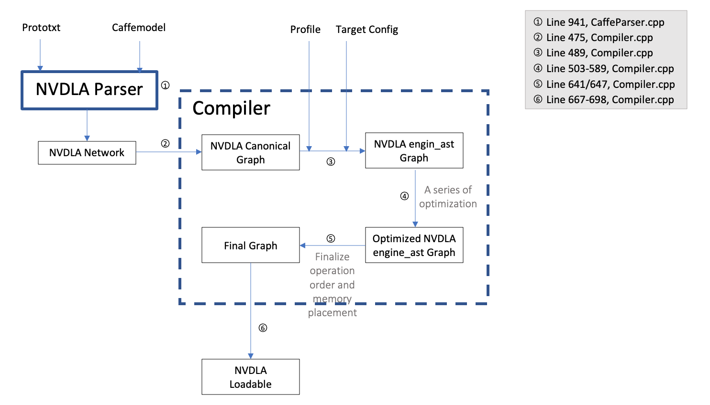

# Integrate-NVDLA-and-TVM(Developing)

## Some Notes 
1. Official code for NVDLA software [sw](https://github.com/nvdla/sw). Official document [sw doc](http://nvdla.org/sw/contents.html). 
2.  To compile the umd part in sw, use command `make <path to sw>/sw/umd/out/core/src/compiler/libnvdla_compiler/libnvdla_compiler.so`
3. Main functions of compiler and parser are in `/umd/core/src/compiler/caffe/CaffeParser.cpp`
4. (Not sure) Parser output: A network. Defination of class network (in `/core/include/nvdla/INetwork.h`).
5. Main part of compiler is in `/umd/core/src/compiler/Compiler.cpp`, main function is `Compiler::compileInternal()`
6. For using nvdla_runtime to generate inference output, this will take a long time. If yo run this in a docker container, use `docker commit` to save your container, or after you exit and restart it, all message will lost.
7. Draw caffe model structure: http://ethereon.github.io/netscope/#/editor

## Current Progress:
1. Successfully compile and run ResNet-101.
2. Environment setup.
3. Source code reading of parser.
4. Source code reading of compiler.
5. Figure out the workflow of NVDLA compiler.
6. Workflow design.

##  <span id="vpforbuilt"> Environment Setup (Virtual Platform)</span>
1. Use Ubuntu 14.04.
2. Install following [2. Using the Virtual Simulator](http://nvdla.org/vp.html).

    NOTE: If fail on VP `make install` with `error: ‘template class std::auto_ptr’ is deprecated [-Werror=deprecated-declarations]`, check the [issues #17 of vp](https://github.com/nvdla/vp/issues/17).
  
3. Run the virtual platform following [2.5 Running the Virtual Simulator](http://nvdla.org/vp.html#running-the-virtual-simulator)

    NOTE: In step 2.5.1, the demo linux kernel image is in `sw/prebuilt/arm64-linux`, copy the image folder to `vp`, `cp -R <path to sw>/sw/prebuilt/arm64-linux/images <path to vp>/vp/`

## <span id="vpindocker"> Another Way for Enviroment Setup - virtual platform docker image</span>
The vp docker image official site: [Docker NVDLA VP](https://hub.docker.com/r/nvdla/vp)
1. Start the container

`docker pull nvdla/vp # pull the docker image docker`
`docker run -it -v /home:/home nvdla/vp # create and start the container`

2. Start NVDLA virtual simulator

Inside the container: 
`cd /usr/local/nvdla aarch64_toplevel -c aarch64_nvdla.lua # start the virtual simulator`
\# Login the kernel with account 'root' and password 'nvdla'

Install NVDLA demo kernel driver

After login the kernel: 
`mount -t 9p -o trans=virtio r /mnt # mount pwd` 
`cd /mnt insmod drm.ko # install drm driver`
`insmod opendla.ko # install nvdla driver`

3. Exit NVDLA virtual simulator

ctrl+a x

## <span id="rebuild"> How to change and rebuild compiler</span> 
NVDLA Compiler can be updated using source code and rebuild as below. Ref: [modifying-nvdla-compiler](https://github.com/prasshantg/personal#modifying-nvdla-compiler)
```
cd {sw-repo-root}/umd
export TOP={sw-repo-root}/umd
make compiler
```
The rebuilt compiler is in `./out/apps/compiler/nvdla_compiler`, copy libnvdla_compiler.so to the same folder to use the rebuilt compiler:
`cp <path to sw>/sw/umd/out/core/src/compiler/libnvdla_compiler/libnvdla_compiler.so <path to sw>/sw/umd/out/apps/compiler/nvdla_compiler/`

In some cases if compiler build fails because of linking error with protobuf library then rebuild protobuf library as below 
```
cd <path to sw>/sw/umd/external/protobuf-2.6
./configure --enable-shared
make
make check
sudo make install
```
## How to Run the Whole Process for Model Inference(TODO)

## Compiler source code reading
### Brief overview of compiler part


### Debug the compiler using gdb
1. Build the executable compiler. [Check here for how to build a compiler on your own](#rebuild)
2. `gdb --args ./nvdla_compiler --prototxt lenet.prototxt --caffemodel lenet_iter_10000.caffemodel`


### Usage of execuatble compiler and runtime
```
> ./nvdla_compiler -h
Usage: ./nvdla_compiler [-options] --prototxt <prototxt_file> --caffemodel <caffemodel_file>
where options include:
    -h                                                          print this help message
    -o <outputpath>                                             outputs wisdom files in 'outputpath' directory
    --profile <basic|default|performance|fast-math>             computation profile (default: fast-math)
    --cprecision <fp16|int8>                                    compute precision (default: fp16)
    --configtarget <opendla-full|opendla-large|opendla-small>   target platform (default: nv_full)
    --calibtable <int8 calib file>                              calibration table for INT8 networks (default: 0.00787)
    --quantizationMode <per-kernel|per-filter>                  quantization mode for INT8 (default: per-kernel)
    --batch                                                     batch size (default: 1)
    --informat <ncxhwx|nchw|nhwc>                               input data format (default: nhwc)

> ./nvdla_runtime -h
Usage: ./nvdla_runtime [-options] --loadable <loadable_file>
where options include:
    -h                    print this help message
    -s                    launch test in server mode
    --image <file>        input jpg/pgm file
    --normalize <value>   normalize value for input image
    --mean <value>        comma separated mean value for input image
    --rawdump             dump raw dimg data


```
### Functions
```
NvDlaError compileProfile(const TestAppArgs* appArgs, TestInfo* i);
/* Function:
Get the compiler: nvdla::ICompiler* compiler = i->wisdom->getCompiler();
Get target, a string <opendla-full|opendla-large|opendla-small>: targetConfigName = appArgs->configtarget;
Determine Profile, a string <basic|default|performance|fast-math> : init named profile (basic/default/performance) with default params in its constructor and exit
Compile: use function compile of class compiler.
*/

NvDlaError Compiler::compile(const char *tp_name, const char *target_config_name, ILoadable **peli);
// Function: call compileInternal function

NvDlaError Compiler::compileInternal(const char *tp_name, const char *target_config_name, ILoadable **peli, bool fullCompile);
/* Function: Interface from compile function to compileInternal function */

NvDlaError Compiler::compileInternal(Profile *profile, TargetConfig *target_config, ILoadable **peli, bool fullCompile);
```

## Graph Samples
With LeNet as input.

**Canonical Graph**
```
{_vptr.Graph = 0x7ffff7d83190 <vtable for nvdla::priv::canonical_ast::Graph+16>, 
         m_nodes = std::set with 8 elements = {[0] = 0x555555891800 and so on},
      
         m_edges = std::set with 9 elements = { [0] = 0x555555841a70 and so on}, 
         
         m_node_attr_map = std::unordered_map with 8 elements = {[0x555555841900] = {
        m_edges = {std::vector of length 1, capacity 1 = {0x555555854a30}, 
          std::vector of length 1, capacity 1 = {0x5555558547a0}}}, [0x555555841780] = {m_edges = {
          std::vector of length 1, capacity 1 = {0x5555558547a0}, 
          std::vector of length 1, capacity 1 = {0x555555845320}}}, [0x5555558411b0] = {m_edges = {
          std::vector of length 1, capacity 1 = {0x555555842070}, 
          std::vector of length 1, capacity 1 = {0x555555841d60}}}, [0x555555891800] = {m_edges = {
          std::vector of length 1, capacity 1 = {0x555555841d60}, 
          std::vector of length 1, capacity 1 = {0x555555841a70}}}, [0x555555841380] = {m_edges = {
          std::vector of length 1, capacity 1 = {0x555555842740}, 
          std::vector of length 1, capacity 1 = {0x5555558423e0}}}, [0x5555558414d0] = {m_edges = {
          std::vector of length 1, capacity 1 = {0x555555844860}, 
          std::vector of length 1, capacity 1 = {0x555555842740}}}, [0x555555891140] = {m_edges = {
          std::vector of length 1, capacity 1 = {0x5555558423e0}, 
          std::vector of length 1, capacity 1 = {0x555555842070}}}, [0x555555841650] = {m_edges = {
          std::vector of length 1, capacity 1 = {0x555555845320}, 
          std::vector of length 1, capacity 1 = {0x555555844860}}}}, 
    m_edge_attr_map = std::unordered_map with 9 elements = {[0x5555558547a0] = {m_nodes = {
          std::vector of length 1, capacity 1 = {0x555555841780}, 
          std::vector of length 1, capacity 1 = {0x555555841900}}}, [0x555555845320] = {m_nodes = {
          std::vector of length 1, capacity 1 = {0x555555841650}, 
          std::vector of length 1, capacity 1 = {0x555555841780}}}, [0x555555841d60] = {m_nodes = {
          std::vector of length 1, capacity 1 = {0x555555891800}, 
          std::vector of length 1, capacity 1 = {0x5555558411b0}}}, [0x555555842070] = {m_nodes = {
          std::vector of length 1, capacity 1 = {0x5555558411b0}, 
          std::vector of length 1, capacity 1 = {0x555555891140}}}, [0x555555841a70] = {m_nodes = {
          std::vector of length 0, capacity 1, std::vector of length 1, capacity 1 = {
            0x555555891800}}}, [0x555555844860] = {m_nodes = {
          std::vector of length 1, capacity 1 = {0x5555558414d0}, 
          std::vector of length 1, capacity 1 = {0x555555841650}}}, [0x555555854a30] = {m_nodes = {
          std::vector of length 1, capacity 1 = {0x555555841900}, 
          std::vector of length 0, capacity 1}}, [0x5555558423e0] = {m_nodes = {
          std::vector of length 1, capacity 1 = {0x555555891140}, 
          std::vector of length 1, capacity 1 = {0x555555841380}}}, [0x555555842740] = {m_nodes = {
          std::vector of length 1, capacity 1 = {0x555555841380}, 
          std::vector of length 1, capacity 1 = {0x5555558414d0}}}}}, 
      m_scored_ordering = 0x55555588a870} //Where Json File comes from    
          
         
  m_next_node_id = 8, //Check, equals # of layers
  m_next_edge_id = 9, //Check, equals # of connections between layers +2(input/output)
  m_dirty = false, //Check
  m_input_edges = std::vector of length 1, capacity 1 = {0x555555841a70}, //Check. a vector of the input Canonical Edges      
  m_output_edges = std::vector of length 1, capacity 1 = {0x555555854a30},  //Check. a vector of the output Canonical Edges
```

  
**Canonical Node**
Definition of protected attributes in a Canonical Node: (Line 619 in CanonicalAST.h) Nodes of paramters are written by Dan.
```
protected:
        std::string     m_id; // unique within the graph
        NvU32           m_unique_id; // id for graph ordering. u32 instead of string.
        static NvU32    m_next_id;
        std::string     m_name;
        Graph*          m_containing_graph;
        CanonicalOpType m_can_op_type; // Determine the type of operation, like conv or FC or activation.
        CanonicalParams m_basic_can_params; //parameters of a layer like input shape and output shape
        EdgeSequence    m_input_edges;
        EdgeSequence    m_output_edges;
```
A Sample of Canonical Node:
```
{
_vptr.Node = 0x7ffff7d83150 <vtable for nvdla::priv::canonical_ast::ConvolutionNode+16>, 

  m_id = "n-0", 
  m_unique_id = 0, 
  static m_next_id = 8, 
  m_name = "conv1", 
  m_containing_graph = 0x5555558b6440, //indicating address of the graph object it belongs to
  m_can_op_type = {m_e = 0, 
    static s_c_str = 0x7ffff7a0fefa "CanonicalOpTypeEnum", 

    static s_c_strs = 0x7ffff7d7cec0 <nvdla::priv::SequenceEnum<nvdla::priv::canonical_ast::CanonicalOpTypeEnum, unsigned short>::s_c_strs>, static s_num_elements = 12}, 

  m_basic_can_params = {
    _vptr.CanonicalParams = 0x7ffff7d82e58 <vtable for nvdla::priv::canonical_ast::CanonicalParams+16>}, 

  m_input_edges = std::vector of length 1, capacity 1 = {0x555555841a70}, 
 	
  m_output_edges = std::vector of length 1, capacity 1 = {0x555555841d60}
 	}
```
**Canonical Edge**
Sample:
```
{_vptr.Edge = 0x7ffff7d83200 <vtable for nvdla::priv::canonical_ast::Edge+16>, 
  m_id = "e-0", 
  m_unique_id = 0, 
  static m_next_id = 9,
  m_containing_graph = 0x5555558b6440, 
  m_original_tensor = 0x555555841ac0}
```
For `m_original_tensor`:
```
{<nvdla::ITensor> = {_vptr.ITensor = 0x7ffff7d93f08 <vtable for nvdla::priv::Tensor+16>}, 
  mDimensions = {n = 64, c = 1, h = 28, w = 28},
  mNetwork = 0x0, 
  mName = "data", 
  mDataFormat = {m_v = 0 '\000'}, 
  mDataType = {m_v = 0 '\000'}, 
  mTensorType = nvdla::kNW_INPUT, 
  mChnlScales = std::vector of length 1, capacity 1 = {1}, 
  mChnlOffsets = std::vector of length 0, capacity 0}
```
