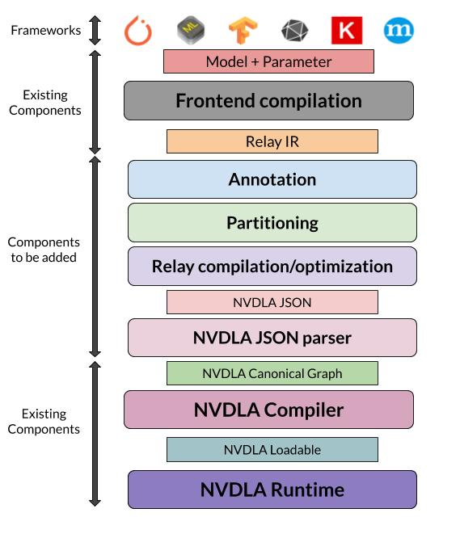

# Integrate-NVDLA-and-TVM (WIP)

Official code for NVDLA software [sw](https://github.com/nvdla/sw). Official document [sw doc](http://nvdla.org/sw/contents.html). 

## Designed Workflow



First, TVM performs frontend compilation to translate frontend languages such as Caffe to intermediate representation using the existing Relay compiler. Then, TVM’s Bring Your Own Codegen (BYOC) framework infrastructure is used to convert the Relay IR into a json file containing the neural network information. Then, the modified and rebuilt NVDLA compiler accepts the json file as input and outputs a loadable file. Finally, the loadable file and test image are fed to the NVDLA runtime for model inference. 

For more information, refer to the [complete project report](files/project_presentation.pdf) in the folder. 

## Current Progress:
1. Generate NVDLA-specific JSON using TVM frontend compilation tool. 
2. Succesfully run LeNet network architecture (in Relay) on the NVDLA hardware simulator.


## How to use 
\[TVM part\]
1. Install TVM from source using [modified GitHub source code](https://github.com/shivmgg/tvm). 
```
git clone --recursive https://github.com/shivmgg/tvm
```
2. Follow instructions given [here](https://tvm.apache.org/docs/install/from_source.html#developers-get-source-from-github) to complete the installation. 
3. Run one of example files in `examples` folder to generate an NVDLA-specific JSON file. 
4. To generate a JSON for LeNet architecture using Relay, run
```
python3.6 examples/run_LeNet_Relay.py
````

\[NVDLA part\]
1. Build NVDLA hardware simulator. Follow by [NVDLA official document](http://nvdla.org/vp.html).
2. Get and build the [modified NVDLA compiler code](https://github.com/WuDan0399/nvdla_sw/)
```
cd {sw-repo-root}/umd
export TOP={sw-repo-root}/umd
make compiler
```
The compiler is in `./out/apps/compiler/nvdla_compiler`, copy libnvdla_compiler.so to the same folder to use the compiler:
`cp <path to sw>/sw/umd/out/core/src/compiler/libnvdla_compiler/libnvdla_compiler.so <path to sw>/sw/umd/out/apps/compiler/nvdla_compiler/`

## How to Run the Whole Process for Model Inference
1. Generate a JSON for LeNet architecture using Relay, run
```
python3.6 examples/run_LeNet_Relay.py
```
2. Use Json file as input and generate loadable file.
```
cd <path to sw>/sw/umd/out/apps/compiler/nvdla_compiler/
./nvdla_compiler --jsonfile <path_to_json_file>
```
